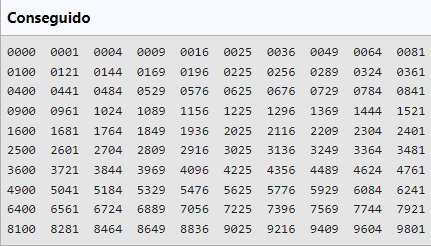

### Ejemplos Java
```java
public class cuadrado{
    public static void main(String[] args){
        for(int i=1;i<100;i++){
            if (i%10==0){
                System.out.println();
                if((i*i)<10) System.out.print("000"+(i*i)+"  ");
                else{
                    if((i*i)<100) System.out.print("00"+(i*i)+"  ");
                    else{
                        if((i*i)<1000) System.out.print("0"+(i*i)+"  ");
                        else System.out.print((i*i)+"  ");
                    }
                }
            }
            else{
                if(i==1) System.out.print("0000  ");
                if((i*i)<10) System.out.print("000"+(i*i)+"  ");
                else{
                    if((i*i)<100) System.out.print("00"+(i*i)+"  ");
                    else{
                        if((i*i)<1000) System.out.print("0"+(i*i)+"  ");  
                        else System.out.print((i*i)+"  ");
                    }
                }
            }
            
        }
    }
}
```


```java
import java.util.Scanner;
public class zorro{
    public static void main(String[] args){
        Scanner sc = new Scanner(System.in);
        int n = sc.nextInt();
        for(int i=0;i<n;i++){
            int num = sc.nextInt();
            String car = sc.next();
            if(num>=4 || num<=(-4)){
                if(num>=0){
                    for(int j=0;j<(num-2);j++){
                        System.out.print(car);
                    }
                    System.out.println();
                    for(int x=0;x<(num-2);x++){
                        for(int j=(x-(num-3));j<0;j++){
                            System.out.print(" ");
                        }
                        System.out.println(car);
                        
                    }
                    for(int j=0;j<(num-2);j++){
                        System.out.print(car);
                    }
                    System.out.println();
                }
                else{
                    for(int j=0;j<(num*(-1)-2);j++){
                        System.out.print(car);
                    }
                    System.out.println();
                    for(int j=0;(j<(num*(-1))-2);j++){
                        for(int x=0;x<j;x++){
                            System.out.print(" ");
                        }
                        System.out.println(car);
                    }
                    
                    for(int j=0;j<(num*(-1)-2);j++){
                        System.out.print(car);
                    }
                    System.out.println();
                }
            }    
        }
    }    
}
```


## [Ejemplo repositorio de GitHub](https://github.com/Xacobo23/Conference-web)